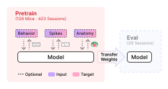
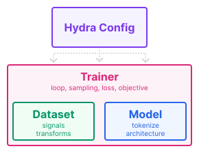

.. _pretraining_guide:

Pretraining
===========

This guide walks through pretraining on the IBL BrainWideBench. The benchmark
provides dataset classes, trainers, and `Hydra <https://hydra.cc/docs/intro/>`__
configs for several reference models out-of-the-box. In addition, these resources
are provided to help you design your own models and pretraining strategies. The
output of pretraining is a checkpoint that is then loaded downstream for the
evaluation pipeline.

.. note::

   The benchmark places no requirements on what type of data or training objective you use for
   pretraining. The pretrain sessions provide spikes, behavioral signals, and anatomical
   labels. A key design decision is how to leverage, transform, and combine these
   modalities to learn representations that transfer well to evaluation.

.. contents:: On this page
   :local:
   :depth: 2

Key concepts
------------

Pretraining is built from four components that can each be extended independently:

.. raw:: html

   
<strong class="bwb-pink">Trainer</strong> 
   Owns the training loop, sampling strategy, loss, and objective. Instantiates and connects Dataset and Model.

   
<strong class="bwb-emerald">Dataset</strong> 
   Controls which signals are loaded for each session and how they are normalized and transformed.

   
<strong class="bwb-blue">Model</strong> 
   Defines the network architecture and the <code>input_fn</code> method that converts raw data into model inputs.

   
   
<strong class="bwb-violet">Config</strong> 
   Hydra configs wire the three components above together and control all hyperparameters.

.. Each model has a ``configs/trainer/`` and ``configs/model/`` directory; the base training config lives at ``src/pretrain/configs/train.yaml``.
.. Subclass :class:`~core.model.BaseModel` and implement ``input_fn`` (converts a raw ``Data`` slice into model inputs on CPUs before collating) and ``forward``.
.. Subclass :class:`~core.trainer.BaseTrainer` and implement ``train_epoch`` and ``val_epoch`` to define a custom objective.

How is the code organized?
--------------------------

All pretraining code lives under ``src/pretrain/``. The entry point is
``train.py``; everything else is organized into three subdirectories that map
directly onto the four components above:

.. raw:: html

   <pre class="bwb-tree">
   src/pretrain/
   ├── train.py                        # entry point
   ├── configs/
   │   └── train.yaml                  # base config (epochs, lr, batch size, ckpt, wandb, ...)
   ├── datasets/
   │   ├── single_task_behavior.py     # IBLBrainWideBenchSingleTaskBehavior
   │   ├── multi_task_behavior.py      # IBLBrainWideBenchMultiTaskBehavior
   │   └── ...
   └── models/
       └── &lt;model&gt;/                    # one directory per model (ndt_stitch, mtm, poyo, possm, ...)
           ├── &lt;model&gt;.py              # model class (subclass of BaseModel)
           ├── trainer/
           │   └── &lt;model&gt;_pretrain.py # trainer class (subclass of BaseTrainer)
           └── configs/
               ├── model/              # model architecture configs (e.g. ndt_stitch_10M.yaml)
               └── trainer/            # trainer configs (e.g. ndt_stitch_pretrain.yaml)
   </pre>

Two things follow from that layout:

1. **Some datasets are already shared between models.** Reuse one if it fits your
   objective:

   - :class:`~pretrain.datasets.IBLBrainWideBenchMaskModelingSpikes`: binned spikes alone,
     used by MtM, NDT2 and NDT Stitch.
   - :class:`~pretrain.datasets.IBLBrainWideBenchSingleTaskBehavior`: spikes aligned to one
     behavioral target, used by POYO and POSSM.
   - :class:`~pretrain.datasets.IBLBrainWideBenchMultiTaskBehavior`: spikes aligned to
     several at once, used by POYO+ and POSSM.
   - :class:`~core.dataset.WholeSessionSpikeDataset`: whole sessions after neural QC, for
     models reading unit features rather than a window of spikes. NEMO reads it directly
     and NuCLR subclasses it.

   If none fits, design your own by subclassing
   :class:`~core.dataset.IBLBrainWideBench2026`, which all four extend.

2. **Each model is self-contained.** Model class, trainer, and Hydra configs all live
   in one directory. This is intentional: adding your own model means creating a new
   directory with the same layout, without having to touch any central code. A minimal
   template to copy from is available at ``src/pretrain/models/my_model/``.

.. note::

   Hydra config discovery is handled by ``src/hydra_plugins/model_config_discovery.py``,
   which scans every subdirectory of ``pretrain/models/`` for a ``configs/`` folder and
   registers as additional search paths. This means any ``configs/model/`` or
   ``configs/trainer/`` directory inside your model package is treated exactly as if it
   lived in the central ``src/pretrain/configs/`` directory, and its configs are
   immediately available as command-line overrides alongside the built-in ones.

For a full walkthrough of how to implement your own model, trainer, and
configs, see `What should I implement?`_ below. For the complete list of Hydra config
options, see `Key config options`_, and :ref:`setup_env_file` for how a ``.env`` value
reaches one.

The responsibilities of each component, and the order a sample passes through on its
way to the model, are laid out in :ref:`codebase_overview`.

What should I implement?
------------------------

The table below orders use cases from simplest to most complex. The first thing
to touch is almost always the Model, it is self-contained and does not require
changing the data pipeline. Dataset and Trainer modifications are more involved
because they affect how data is loaded, sampled, and supervised.

.. list-table::
   :widths: 40 20 20 20
   :header-rows: 1

   * - Goal
     - Model
     - Trainer
     - Dataset
   * - Run an existing model as-is
     - Reuse
     - Reuse
     - Reuse
   * - Add a new architecture
     - Implement
     - Implement
     - Reuse
   * - New architecture with custom signals
     - Implement
     - Implement
     - Subclass

Run an existing model as-is
~~~~~~~~~~~~~~~~~~~~~~~~~~~

Pick a trainer config and run. Set the environment up first and the data root: see :ref:`setup_env_file` and :ref:`setup_data_root`. 
None of the commands in this guide pass a data root, they read it from the environment. 
Add ``data_root=`` to point a single run somewhere else.

The following runs NDT pretraining on all pretrain sessions with default
hyperparameters:

.. code-block:: bash

   python src/pretrain/train.py trainer=ndt_stitch_pretrain

`Launching training`_ covers the other overrides, from model size to the sessions a
run reads. `Reference baselines`_ lists the trainer config for every model that ships
with the benchmark.

.. _pretrain_add_architecture:

Add a new architecture
~~~~~~~~~~~~~~~~~~~~~~

The easiest case, with no data pipeline changes needed.

- Copy ``src/pretrain/models/my_model/`` as a starting point.
- Implement your model on :class:`~core.model.BaseModel` (the model interface used by
  the standard pipeline).
- Implement a trainer that instantiates it on :class:`~core.trainer.BaseTrainer` (the
  training loop every model's trainer is built on).

Both interfaces document what each method is handed and when the run calls it:

.. code-block:: python
   :caption: src/pretrain/models/my_model/my_model.py

   import torch.nn as nn
   from core.model import BaseModel

   class MyModel(BaseModel):
       def __init__(self, dim: int):
           super().__init__()
           self.net = nn.Linear(dim, dim)

       def input_fn(self, data):
           # convert a Data slice into a dict of tensors
           return {"model_inputs": {"x": ...}}

       def forward(self, x):
           return self.net(x)

.. code-block:: python
   :caption: src/pretrain/models/my_model/my_model_pretrain.py

   from torch.utils.data import DataLoader

   from core.trainer import BaseTrainer
   from pretrain.datasets import IBLBrainWideBenchMaskModelingSpikes

   class MyModelPretrain(BaseTrainer):
       def setup(self, ckpt):
           self.setup_train_loader()
           self.setup_val_loader()
           self.model = MyModel(self.cfg.model.dim)
           self.model.link_datasets(
               self.train_loader.dataset,
               self.val_loader.dataset,
           )
           self.model.to(self.device)
           self.setup_optimizers(ckpt)

       def setup_train_loader(self):
           # one of the shared datasets, see the next section for the others
           self.train_dataset = IBLBrainWideBenchMaskModelingSpikes(
               root=self.cfg.data_root,
               recording_ids=self.cfg.recording_ids,
               split="train",
           )
           self.train_loader = DataLoader(self.train_dataset)

       def train_epoch(self):
           for batch in self.train_loader:
               ...
               # yours to increment: the base only checkpoints and restores it
               self.train_step += 1

       def val_epoch(self):
           metrics = ...
           # save_if_best keeps the best weights, step_patience turns that into the
           # early-stop verdict train breaks on
           improved = self.save_if_best(metrics["loss"], metrics=metrics)
           # best_metrics carries best/val/avg, the key tuning and sweeps select on
           self.return_value = metrics | self.best_metrics
           return self.step_patience(improved)

``setup_val_loader`` and ``setup_optimizers`` are yours to write in the same way, and the
template has both. Of everything above, only :meth:`~core.trainer.BaseTrainer.setup`,
``train_epoch`` and ``val_epoch`` are called by the run itself. In exchange the base handles
logging, checkpointing and DDP, and offers ``get_param_groups`` and
``clip_and_log_grad_norm`` for the optimizer and the backward pass.

Finally the two Hydra configs, which the discovery plugin picks up from your own
directory without touching anything central:

.. code-block:: yaml
   :caption: src/pretrain/models/my_model/configs/model/my_model.yaml

   # @package _global_

   model:
     _target_: pretrain.models.my_model.MyModel
     dim: 256

.. code-block:: yaml
   :caption: src/pretrain/models/my_model/configs/trainer/my_model_pretrain.yaml

   # @package _global_
   defaults:
     - override /model: my_model  # the model config above, by file name
     - _self_

   trainer:
     _target_: pretrain.models.my_model.MyModelPretrain

   num_epochs: 100

What the trainer loads is the one choice left, and one of the shared datasets
usually covers it.

Which dataset class should I use?
~~~~~~~~~~~~~~~~~~~~~~~~~~~~~~~~~

The dataset class controls what signals are available during training, and so what
the trainer can supervise on. One of the shared ones usually fits:

**Spike-only** (:class:`~pretrain.datasets.IBLBrainWideBenchMaskModelingSpikes`)

   Binned spike counts, no behavioral signal attached. Used by MtM, NDT2 and NDT
   Stitch. The objective is left entirely to the trainer, masked spike prediction
   for instance.

**Single-task behavior** (:class:`~pretrain.datasets.IBLBrainWideBenchSingleTaskBehavior`)

   Spikes alongside one behavioral signal, chosen at config time with ``task``. The
   signal is normalized for you: z-scored for pixel-valued signals such as whisker
   and paw speed, binned for licking rate, left raw for wheel speed. Used by POYO
   and POSSM single-task.

   .. code-block:: yaml

      task: wheel_speed  # one of the supported TS1 tasks

**Multi-task behavior** (:class:`~pretrain.datasets.IBLBrainWideBenchMultiTaskBehavior`)

   Spikes alongside several behavioral signals at once. Used by POYO+ and POSSM
   multi-task. The ``tasks`` field takes any of the supported TS1 tasks, and left
   null it takes all of them.

   .. code-block:: yaml

      tasks:
        - wheel_speed
        - whisker_motion_energy
        - choice

**Unit-level** (:class:`~core.dataset.WholeSessionSpikeDataset`)

   Whole sessions after neural QC, for models reading unit features rather than a
   window of spikes. NEMO reads it directly and NuCLR subclasses it.

If none of them carries the signal you need, write your own and carry on at
`New architecture with custom signals`_. Datasets and trainers are not coupled: any
trainer can instantiate any dataset, and what supervises the model is whatever the
trainer reads from the batch.

New architecture with custom signals
~~~~~~~~~~~~~~~~~~~~~~~~~~~~~~~~~~~~

The most involved case, since it touches the data pipeline. Start from the same
``src/pretrain/models/my_model/`` template as `Add a new architecture`_, then subclass
the shared dataset that carries the closest signal and override ``dataset_transform``
to add or modify your own:

.. code-block:: python
   :caption: src/pretrain/models/my_model/my_dataset.py

   from pretrain.datasets import IBLBrainWideBenchSingleTaskBehavior

   class MyDataset(IBLBrainWideBenchSingleTaskBehavior):
       def dataset_transform(self, data):
           data = super().dataset_transform(data)
           # add or modify signals on data here
           return data

``dataset_transform`` runs per sample, before any augmentation and before the model's
``input_fn``, so whatever it writes onto ``data`` is there for ``input_fn`` to read into
the batch: see :ref:`pretraining_sample_flow`. The trainer loads that dataset and
supervises on the signal:

.. code-block:: python
   :caption: src/pretrain/models/my_model/my_model_pretrain.py

   from torch.utils.data import DataLoader

   from core.trainer import BaseTrainer

   from .my_dataset import MyDataset

   class MyModelPretrain(BaseTrainer):
       def setup_train_loader(self):
           self.train_dataset = MyDataset(
               root=self.cfg.data_root,
               recording_ids=self.cfg.recording_ids,
               split="train",
               task=self.cfg.task,  # add `task: ???` to your trainer config
           )
           self.train_loader = DataLoader(self.train_dataset)

       def train_epoch(self):
           for batch in self.train_loader:
               # read your signal off the batch and compute the loss
               ...

Your trainer subclasses :class:`~core.trainer.BaseTrainer`, never another model's
trainer: a training protocol is part of a model's reported result, so tuning yours
must not be able to move an existing model's numbers. To start from an existing loop,
copy it into your trainer and edit it there.

Launching training
------------------

The entry point is ``src/pretrain/train.py``, driven by
`Hydra <https://hydra.cc/docs/intro/>`__. The base config is
``src/pretrain/configs/train.yaml``; trainer-specific overrides live under
each model's ``configs/trainer/`` directory.

Select a trainer with the ``trainer`` override. Hydra composes the trainer
config on top of the base config:

.. code-block:: bash

   python src/pretrain/train.py trainer=ndt_stitch_pretrain

   # a trainer you added yourself, by the file name of its config
   python src/pretrain/train.py trainer=my_model_pretrain

``trainer=ndt_stitch_pretrain`` selects the NDT Stitch trainer config, which in turn pulls in
the ``ndt_stitch_10M`` model config by default. Training logs to WandB and saves a
checkpoint to ``ckpt/`` when it finishes. To use a different model size:

.. code-block:: bash

   python src/pretrain/train.py trainer=ndt_stitch_pretrain model=ndt_stitch_20M

For models that require a behavioral task (POYO, POSSM single):

.. code-block:: bash

   python src/pretrain/train.py trainer=poyo_pretrain task=wheel_speed

To train on a subset of sessions, pass a list of recording IDs:

.. code-block:: bash

   python src/pretrain/train.py trainer=ndt_stitch_pretrain "recording_ids=[session_id_1, session_id_2]"

The checkpoint directory and WandB project can be overridden inline:

.. code-block:: bash

   python src/pretrain/train.py trainer=ndt_stitch_pretrain ckpt.dir=/my/ckpt/dir wandb.project=my-project

Key config options
~~~~~~~~~~~~~~~~~~

All options below can be overridden on the command line or in a config file.

**Training**

.. code-block:: yaml

   num_epochs: 100
   batch_size: 32
   base_lr: 1e-3          # most trainers scale it, see below
   weight_decay: 1e-4
   no_weight_decay: ["bias", "norm", "emb"]   # name fragments exempt from decay
   precision: bf16        # bf16 | fp32
   seed: 42
   grad_clip: 1.0         # set to null to disable gradient clipping
   grad_accum_steps: 1

Scaling the learning rate is each trainer's own choice, not something
:class:`~core.trainer.BaseTrainer` does. Most set the scheduler's ``max_lr`` to
``base_lr * sqrt(batch_size)``; NuCLR and NEMO use ``base_lr`` as written, as the
evaluation suites do. Check yours before carrying a learning rate between models.

``bf16`` is the recommended precision for pretraining and the default every shipped
trainer runs at (RRR excepted). ``fp16`` is advised against.

**Checkpointing**

.. code-block:: yaml

   ckpt:
     enable: true
     dir: ckpt/
     save_last: true       # always saves the final epoch
     every_n_epochs: null  # set to an int to also save intermediate checkpoints
     load_from: null       # path to a checkpoint to resume from
     resume: false         # if true, restores optimizer and scheduler state too

What skips weight decay
~~~~~~~~~~~~~~~~~~~~~~~

``BaseTrainer.get_param_groups`` exempts 1-D params and any name matching
``no_weight_decay``. The default catches every lookup table because they are all
named ``*_emb``, and a lookup row is decayed every step but updated only when its
unit or session is in the batch. So name a lookup ``*_emb`` and a weight matrix
anything else (``ndt_superv``: ``spike_emb`` vs ``spike_proj``). An override
replaces the list rather than extending it, so repeat the default
(``rrr`` adds ``bs.``).

WandB logging
~~~~~~~~~~~~~

Set ``wandb.project`` and ``wandb.entity`` to route runs to your workspace.
Pass ``wandb.mode=disabled`` to run without logging:

.. code-block:: bash

   python src/pretrain/train.py trainer=ndt_stitch_pretrain \
       wandb.project=my-project \
       wandb.entity=my-team

Multi-GPU (DDP)
~~~~~~~~~~~~~~~

DDP is enabled automatically when multiple GPUs are detected. Set
``ddp.force=true`` to run DDP on a single GPU (useful for debugging):

.. code-block:: bash

   python src/pretrain/train.py trainer=ndt_stitch_pretrain ddp.force=true

.. _pretrain_released_ckpts:

Released checkpoints
--------------------

The checkpoint behind every model in the paper's reported results is published on the
`Hugging Face Hub <https://huggingface.co/NerDSLab>`_ and the
`W&B <https://wandb.ai/ibl-benchmark>`_ run that wrote it is public too. The trainer
config each one was produced with is in `Reference baselines`_.

.. list-table::
   :widths: 18 12 26 24
   :header-rows: 1

   * - Model
     - Size
     - Hub
     - W&B
   * - NDT Stitch
     - 519 MB
     - .. image:: https://huggingface.co/datasets/huggingface/badges/resolve/main/model-on-hf-md.svg
          :class: only-light
          :target: https://huggingface.co/NerDSLab/ibl-bwb-ndt_stitch
          :alt: NerDSLab/ibl-bwb-ndt_stitch on Hugging Face
          :width: 130px

       .. image:: https://huggingface.co/datasets/huggingface/badges/resolve/main/model-on-hf-md-dark.svg
          :class: only-dark
          :target: https://huggingface.co/NerDSLab/ibl-bwb-ndt_stitch
          :alt: NerDSLab/ibl-bwb-ndt_stitch on Hugging Face
          :width: 130px
     - .. image:: https://raw.githubusercontent.com/wandb/assets/main/wandb-github-badge-gradient.svg
          :class: dark-light
          :target: https://wandb.ai/ibl-benchmark/pretrain-ndt_stitch-release/runs/ookhq759
          :alt: W&B run ookhq759
   * - MtM
     - 839 MB
     - .. image:: https://huggingface.co/datasets/huggingface/badges/resolve/main/model-on-hf-md.svg
          :class: only-light
          :target: https://huggingface.co/NerDSLab/ibl-bwb-mtm
          :alt: NerDSLab/ibl-bwb-mtm on Hugging Face
          :width: 130px

       .. image:: https://huggingface.co/datasets/huggingface/badges/resolve/main/model-on-hf-md-dark.svg
          :class: only-dark
          :target: https://huggingface.co/NerDSLab/ibl-bwb-mtm
          :alt: NerDSLab/ibl-bwb-mtm on Hugging Face
          :width: 130px
     - .. image:: https://raw.githubusercontent.com/wandb/assets/main/wandb-github-badge-gradient.svg
          :class: dark-light
          :target: https://wandb.ai/ibl-benchmark/pretrain-mtm-release/runs/9030uula
          :alt: W&B run 9030uula
   * - POYO+
     - 1.9 GB
     - .. image:: https://huggingface.co/datasets/huggingface/badges/resolve/main/model-on-hf-md.svg
          :class: only-light
          :target: https://huggingface.co/NerDSLab/ibl-bwb-poyo_plus
          :alt: NerDSLab/ibl-bwb-poyo_plus on Hugging Face
          :width: 130px

       .. image:: https://huggingface.co/datasets/huggingface/badges/resolve/main/model-on-hf-md-dark.svg
          :class: only-dark
          :target: https://huggingface.co/NerDSLab/ibl-bwb-poyo_plus
          :alt: NerDSLab/ibl-bwb-poyo_plus on Hugging Face
          :width: 130px
     - .. image:: https://raw.githubusercontent.com/wandb/assets/main/wandb-github-badge-gradient.svg
          :class: dark-light
          :target: https://wandb.ai/ibl-benchmark/poyo-plus-pretrain-release/runs/iy81kqrk
          :alt: W&B run iy81kqrk
   * - POSSM
     - 1.9 GB
     - .. image:: https://huggingface.co/datasets/huggingface/badges/resolve/main/model-on-hf-md.svg
          :class: only-light
          :target: https://huggingface.co/NerDSLab/ibl-bwb-possm
          :alt: NerDSLab/ibl-bwb-possm on Hugging Face
          :width: 130px

       .. image:: https://huggingface.co/datasets/huggingface/badges/resolve/main/model-on-hf-md-dark.svg
          :class: only-dark
          :target: https://huggingface.co/NerDSLab/ibl-bwb-possm
          :alt: NerDSLab/ibl-bwb-possm on Hugging Face
          :width: 130px
     - .. image:: https://raw.githubusercontent.com/wandb/assets/main/wandb-github-badge-gradient.svg
          :class: dark-light
          :target: https://wandb.ai/ibl-benchmark/possm-pretrain-release/runs/hy9q0pwk
          :alt: W&B run hy9q0pwk
   * - NEMO
     - 128 MB
     - .. image:: https://huggingface.co/datasets/huggingface/badges/resolve/main/model-on-hf-md.svg
          :class: only-light
          :target: https://huggingface.co/NerDSLab/ibl-bwb-nemo
          :alt: NerDSLab/ibl-bwb-nemo on Hugging Face
          :width: 130px

       .. image:: https://huggingface.co/datasets/huggingface/badges/resolve/main/model-on-hf-md-dark.svg
          :class: only-dark
          :target: https://huggingface.co/NerDSLab/ibl-bwb-nemo
          :alt: NerDSLab/ibl-bwb-nemo on Hugging Face
          :width: 130px
     - .. image:: https://raw.githubusercontent.com/wandb/assets/main/wandb-github-badge-gradient.svg
          :class: dark-light
          :target: https://wandb.ai/ibl-benchmark/pretrain-nemo-release
          :alt: W&B project pretrain-nemo-release, one run per seed
   * - NuCLR
     - 128 MB
     - .. image:: https://huggingface.co/datasets/huggingface/badges/resolve/main/model-on-hf-md.svg
          :class: only-light
          :target: https://huggingface.co/NerDSLab/ibl-bwb-nuclr
          :alt: NerDSLab/ibl-bwb-nuclr on Hugging Face
          :width: 130px

       .. image:: https://huggingface.co/datasets/huggingface/badges/resolve/main/model-on-hf-md-dark.svg
          :class: only-dark
          :target: https://huggingface.co/NerDSLab/ibl-bwb-nuclr
          :alt: NerDSLab/ibl-bwb-nuclr on Hugging Face
          :width: 130px
     - .. image:: https://raw.githubusercontent.com/wandb/assets/main/wandb-github-badge-gradient.svg
          :class: dark-light
          :target: https://wandb.ai/ibl-benchmark/pretrain-nuclr-release
          :alt: W&B project pretrain-nuclr-release, one run per seed

NuCLR and NEMO are pretrained over five seeds, every other model over one.

A checkpoint file is named after its model, ``<model>.pt`` for the single-seed repositories and
``<model>_<seed>.pt`` for NuCLR and NEMO. ``curl`` needs nothing beyond the base
environment:

.. code-block:: bash

   mkdir -p ckpt
   curl -L https://huggingface.co/NerDSLab/ibl-bwb-ndt_stitch/resolve/main/ndt_stitch.pt \
       -o ckpt/ndt_stitch.pt

``huggingface_hub`` is not part of any install extra, but once added it does the same
with resumable downloads:

.. code-block:: bash

   uv pip install huggingface_hub
   hf download NerDSLab/ibl-bwb-ndt_stitch ndt_stitch.pt --local-dir ckpt

Either way, a downstream trainer loads the file it left behind:

.. code-block:: bash

   python src/ts2/train.py trainer=ndt_stitch_finetune task=co_smoothing \
       recording_id=<session_id> ckpt.load_from=$PWD/ckpt/ndt_stitch.pt

``ckpt.load_from`` is tried as given first, then relative to ``ckpt.dir``
(``BWB_CKPT_DIR`` in your :ref:`.env <setup_env_file>`, default ``./ckpt``), so a
checkpoint downloaded under that directory can be passed as
``ckpt.load_from=ndt_stitch.pt``.

Every pretrained trainer config leaves ``ckpt.load_from`` mandatory
(``???``), so a run started without it fails at config resolution rather than
silently training from scratch.

Reference baselines
--------------------

.. list-table::
   :widths: 16 28 18 30 8
   :header-rows: 1

   * - Model
     - Trainer config
     - Dataset mode
     - Trainer class
     - W&B
   * - `NDT Stitch <https://www.biorxiv.org/content/early/2021/07/23/2021.01.16.426955>`__
     - ``ndt_stitch_pretrain``
     - Spike-only
     - :class:`~pretrain.models.NDTStitchPretrain`
     - .. image:: https://raw.githubusercontent.com/wandb/assets/main/wandb-dots-logo.svg
          :class: dark-light
          :target: https://wandb.ai/ibl-benchmark/pretrain-ndt_stitch-release
          :alt: W&B project pretrain-ndt_stitch-release
          :width: 22px
   * - `MtM <https://openreview.net/forum?id=nRRJsDahEg>`__
     - ``mtm_pretrain``
     - Spike-only
     - :class:`~pretrain.models.MtMPretrain`
     - .. image:: https://raw.githubusercontent.com/wandb/assets/main/wandb-dots-logo.svg
          :class: dark-light
          :target: https://wandb.ai/ibl-benchmark/pretrain-mtm-release
          :alt: W&B project pretrain-mtm-release
          :width: 22px
   * - `POYO+ <https://openreview.net/forum?id=IuU0wcO0mo>`__
     - ``poyo_plus_multitask_pretrain``
     - Multi-task
     - :class:`~pretrain.models.POYOPlusMultitaskPretrain`
     - .. image:: https://raw.githubusercontent.com/wandb/assets/main/wandb-dots-logo.svg
          :class: dark-light
          :target: https://wandb.ai/ibl-benchmark/poyo-plus-pretrain-release
          :alt: W&B project poyo-plus-pretrain-release
          :width: 22px
   * - `POSSM <https://openreview.net/forum?id=1i4wNFgHDd>`__
     - ``possm_multitask_pretrain``
     - Multi-task
     - :class:`~pretrain.models.POSSMMultitaskPretrain`
     - .. image:: https://raw.githubusercontent.com/wandb/assets/main/wandb-dots-logo.svg
          :class: dark-light
          :target: https://wandb.ai/ibl-benchmark/possm-pretrain-release
          :alt: W&B project possm-pretrain-release
          :width: 22px
   * - `NuCLR <https://openreview.net/forum?id=zt3RKc6VBp>`__
     - ``nuclr_pretrain``
     - Unit-level
     - :class:`~pretrain.models.NuCLRPretrain`
     - .. image:: https://raw.githubusercontent.com/wandb/assets/main/wandb-dots-logo.svg
          :class: dark-light
          :target: https://wandb.ai/ibl-benchmark/pretrain-nuclr-release
          :alt: W&B project pretrain-nuclr-release
          :width: 22px
   * - `NEMO <https://openreview.net/forum?id=10JOlFIPjt>`__
     - ``nemo_pretrain``
     - Unit-level
     - :class:`~pretrain.models.NEMOPretrain`
     - .. image:: https://raw.githubusercontent.com/wandb/assets/main/wandb-dots-logo.svg
          :class: dark-light
          :target: https://wandb.ai/ibl-benchmark/pretrain-nemo-release
          :alt: W&B project pretrain-nemo-release
          :width: 22px

Pass a row's Trainer config to reproduce that baseline, the same command each
released checkpoint came from:

.. code-block:: bash

   python src/pretrain/train.py trainer=<trainer config>
