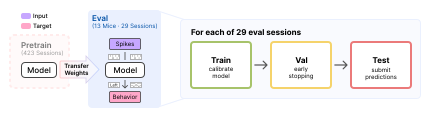
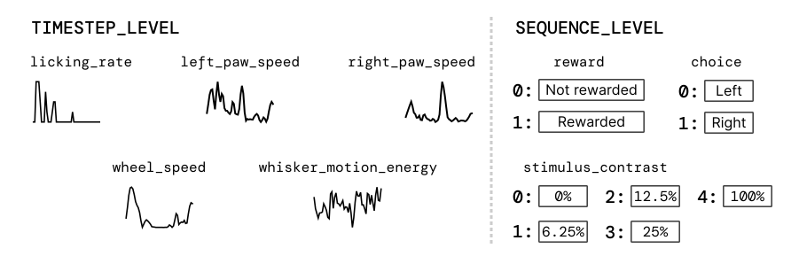
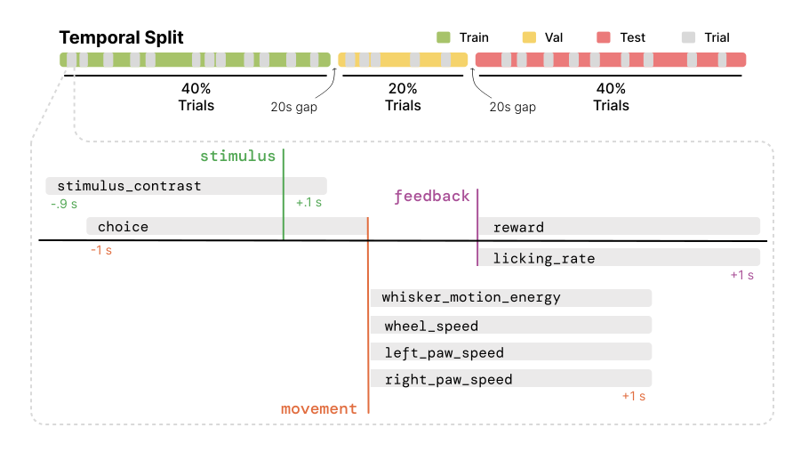

.. _ts1_guide:

Task Suite 1: Behavior Prediction
==================================

TS1 evaluates supervised decoding of behavioral variables from neural population
activity. 

.. contents:: On this page
   :local:
   :depth: 2

Overview of TS1
---------------

Eight tasks are included: 5
timestep-level regression tasks (licking rate, whisker motion energy, wheel speed,
left/right paw speed) and 3 sequence-level classification tasks (stimulus
contrast, choice, reward). Each task expects readouts over a 1 second target window,
but context can come from up to 19 seconds prior to the target window.

   TS1 suite: timestep-level (left) and sequence-level (right) behavior decoding targets.

The tasks are summarized in the table below, including their primary metrics for the benchmark,
and visualized in the figure above.

.. list-table:: TS1 tasks and metrics
   :header-rows: 1
   :widths: 21 30 13 19 17

   * - Task
     - Variable type
     - Resolution
     - Target as served
     - Primary metric
   * - ``whisker_motion_energy``
     - Regression
     - Timestep
     - z-scored
     - :math:`R^2`
   * - ``wheel_speed``
     - Regression
     - Timestep
     - raw
     - :math:`R^2`
   * - ``right_paw_speed``
     - Regression
     - Timestep
     - z-scored
     - :math:`R^2`
   * - ``left_paw_speed``
     - Regression
     - Timestep
     - z-scored
     - :math:`R^2`
   * - ``licking_rate``
     - Regression (rate)
     - Timestep
     - counts per bin
     - Poisson :math:`D^2`
   * - ``stimulus_contrast``
     - 5-way multiclass classification
     - Sequence
     - /
     - Balanced acc.
   * - ``choice``
     - Binary classification
     - Sequence
     - /
     - Balanced acc.
   * - ``reward``
     - Binary classification
     - Sequence
     - /
     - Balanced acc.

The target is conditioned in ``dataset_transform``, before the model or the metric sees
it (:ref:`pretraining_sample_flow`), and the test path always applies it: z-scoring uses
the session's train-split mean and std, and lick rates are divided by the 50 Hz behavior
sampling rate and rounded. Whisker motion energy and paw speeds are measured in pixels,
so their scale depends on the camera and is z-scored away; wheel speed is left raw because
it carries a physical unit that means the same thing in every session.

Evaluation pipeline
~~~~~~~~~~~~~~~~~~~

Evaluation runs on animals unseen during training using a causal 40/20/40
temporal split. 

.. note::

   TS1 is defined on the ``all_units`` build, with no unit quality filtering, and
   every reported TS1 baseline uses it. A filtered build still runs, and the loader
   only warns. Report the build with your results so the difference in setting is
   clear. See :ref:`dataset_builds`.

How to use the TS1 benchmark
----------------------------

The TS1 evaluation pipeline is standardized and can be used with any model. There are two
ways to plug in:

1. **Use the standard pipeline**: implement :class:`~core.model.BaseModel` and pass your
   model to :class:`~ts1.TS1EvalTrainer` (extending it if needed). Training, checkpointing,
   and testing are all handled for you.
2. **Bring your own Trainer**: write your own training loop, but inherit from
   :class:`~ts1.TS1TestMixin` so testing stays standardized. This is required either way.

Key classes
~~~~~~~~~~~

- :class:`~ts1.IBLBrainWideBenchTS1`: dataset for a single session and task.
- :class:`~core.model.BaseModel`: model interface used by the standard pipeline.
- :class:`~ts1.TS1TestMixin`: mixin implementing standardized testing. Required for any Trainer.
- :class:`~ts1.TS1EvalTrainer`: standard Trainer, extends ``TS1TestMixin``.

Get a list of supported tasks
~~~~~~~~~~~~~~~~~~~~~~~~~~~~~

Use :meth:`~ts1.IBLBrainWideBenchTS1.get_ts1_supported_tasks` to see all available task names.

.. code-block:: python

   from ts1 import IBLBrainWideBenchTS1

   tasks = IBLBrainWideBenchTS1.get_ts1_supported_tasks()
   # ['choice', 'reward', 'stimulus_contrast', 'whisker_motion_energy',
   #  'wheel_speed', 'right_paw_speed', 'left_paw_speed', 'licking_rate']

Pass ``target_layout`` to keep only the tasks with a given target layout.

.. code-block:: python

   from ibl_bwb_eval.tasks import TargetLayout

   tasks = IBLBrainWideBenchTS1.get_ts1_supported_tasks(TargetLayout.SEQUENCE_LEVEL)
   # ['choice', 'reward', 'stimulus_contrast']

Loading splits for a specific task
~~~~~~~~~~~~~~~~~~~~~~~~~~~~~~~~~~

Construct :class:`~ts1.IBLBrainWideBenchTS1` directly to get the train/val/test split for one task and session.

.. code-block:: python

   from ts1 import IBLBrainWideBenchTS1

   train_dataset = IBLBrainWideBenchTS1(
       root="/path/to/data",
       split="train",
       task="wheel_speed",
       recording_id="<session_id>",
   )

How do I evaluate my pretrained model on TS1?
~~~~~~~~~~~~~~~~~~~~~~~~~~~~~~~~~~~~~~~~~~~~~

Given a pretrained model, evaluating on TS1 includes any necessary adaptations, followed by
standardized testing. Below we detail the steps for different use cases.

Model-level interface
^^^^^^^^^^^^^^^^^^^^^

If you pretrained in this repo, the model is already a :class:`~core.model.BaseModel`
subclass under ``src/pretrain/models/<model>/`` (:ref:`pretraining_guide`). TS1
finetunes that same class, where it is, so adapting it means adding the methods
pretraining never called.

A model pretrained outside the repo should implement the same interface, from wherever
it lives, to work with the Trainer infrastructure below. You are free to write your own
model and training interfaces instead, as long as testing stays standardized
(`Standardized testing`_).

Either way, make sure the model exposes the interface below:

.. code-block:: python

   from core.model import BaseModel

   class MyModel(BaseModel):
       def input_fn(self, data): ...                       # data -> model inputs
       def configure_readout(self, readout_spec): ...       # attach a task head
       def link_datasets(self, train, val, test=None): ...  # optional, e.g. build a vocab
       def load_ckpt(self, ckpt): ...                        # optional, load pretrained weights

Your model produces inputs, not targets. ``input_fn`` builds the ``X`` half
(:ref:`pretraining_sample_flow`); the dataset builds the target and the trainer receives
it as ``y``, a dict holding what the task needs:

- ``values``, always.
- ``timestamps``, on the five timestep-level tasks.
- ``mask``, only on ``left_paw_speed`` and ``right_paw_speed``, where it carries the pose
  confidence that gates the loss.
- ``trial_id``, when the task's interval carries one.

So a ``loss`` override reads ``y["values"]`` and honours ``y["mask"]``, exactly as
:class:`~ts1.TS1EvalTrainer` does. With a Trainer of your own, both sides are yours to
shape.

Using the standard TS1 Trainer
^^^^^^^^^^^^^^^^^^^^^^^^^^^^^^

We provide a standard Trainer for TS1, :class:`~ts1.TS1EvalTrainer`. Point a Hydra
config's ``model`` at your model and ``trainer`` at it:

.. code-block:: yaml

   model:
     _target_: my_package.MyModel
     # _target_: pretrain.models.my_model.MyModel  # a model pretrained in this repo
   trainer:
     _target_: ts1.TS1EvalTrainer

This can be used out-of-the-box if your model does not require any special adaptations.
It handles data loading, training, checkpointing, and standardized testing automatically.
Which parameters train is set by ``finetuning.strategy``: see :ref:`ts1_key_config`.

Customizing the TS1 Trainer
^^^^^^^^^^^^^^^^^^^^^^^^^^^

If you need to customize the Trainer, you can inherit from :class:`~ts1.TS1EvalTrainer` and
override individual methods (e.g. ``setup_model``, ``link_model``, ``predict``) without
reimplementing the rest:

.. code-block:: python

   from ts1 import TS1EvalTrainer

   class MyEvalTrainer(TS1EvalTrainer):
       def predict(self, X, target_timestamps, mask):
           return self.model(**X["model_inputs"], extra_arg=...)

Augmenting the training input
^^^^^^^^^^^^^^^^^^^^^^^^^^^^^

:class:`~ts1.TS1EvalTrainer` composes the transforms named in ``train_transforms`` onto the dataset,
ahead of the model's ``input_fn``. The list is empty in ``src/ts1/configs/train.yaml``;
set it in your trainer config to augment the sample before the model sees it:

.. code-block:: yaml

   train_transforms:
     - _target_: core.transforms.UnitDropout
       min_units: 0.6

``val_transforms`` and ``test_transforms`` work the same way and are normally left empty.
Augmentation listed here cannot corrupt the target, which is taken from the sample before
these run: see :ref:`pretraining_sample_flow`.

Standardized testing
^^^^^^^^^^^^^^^^^^^^

The standardized testing interface is implemented in the :class:`~ts1.TS1TestMixin` class.
This class handles loading the dataset, sampling intervals, and computing metrics.
Note that :class:`~ts1.TS1EvalTrainer` inherits from it already.

Inherit from it before :class:`~core.trainer.BaseTrainer` in any custom Trainer to get
``setup_test_loader`` and ``test``. Validation is deliberately left out of the mixin, so
``setup_val_loader`` and ``val_epoch`` stay yours to define or override:

.. code-block:: python

   from core.trainer import BaseTrainer
   from ts1 import TS1TestMixin

   class MyEvalTrainer(TS1TestMixin, BaseTrainer):
       def predict(self, X, target_timestamps, mask):
           return self.model(**X["model_inputs"])

.. warning::

   Every Trainer has to test through :class:`~ts1.TS1TestMixin`, whether it is
   :class:`~ts1.TS1EvalTrainer` or one of your own. It fixes what a reported number
   means: the test split, the sampling intervals, the metrics and the prediction file.
   ``setup_test_loader`` and ``test`` are ``final`` for that reason, and the mixin
   itself is not yours to edit. A number from a test loop of your own is not comparable
   with the baselines.

Launching training and evaluation
----------------------------------

The entry point is ``src/ts1/train.py``, driven by `Hydra <https://hydra.cc>`_. One call trains
the model then automatically runs the standardized test protocol at the end:

.. code-block:: bash

   python src/ts1/train.py trainer=linear task=<task> recording_id=<recording_id> \
       save_preds.enable=true save_preds.label=<submission-id>

``save_preds`` writes the prediction file the `leaderboard <https://brainwidebench.iblcore.org/index.html>`_ scores, one per
run at ``<label>/ts1-<task>/<recording_id>/seed_<seed>.safetensors`` under
``BWB_PREDICTIONS_DIR`` from your :ref:`.env <setup_env_file>` (default
``predictions/``), so a submission is one run per task and session. Drop both flags
to train without writing predictions.

The above command defines general-purpose execution on TS1, including for single-session baselines.
To finetune a pretrained model, select its trainer and point ``ckpt.load_from`` at a checkpoint:

.. code-block:: bash

   python src/ts1/train.py trainer=ndt_stitch_finetune task=<task> \
       recording_id=<recording_id> ckpt.load_from=/path/to/ckpt.pt \
       save_preds.enable=true save_preds.label=<submission-id>

.. _ts1_key_config:

Key config options
~~~~~~~~~~~~~~~~~~

Defaults live in ``src/ts1/configs/train.yaml``, and a trainer config overrides what it
needs. Two are worth setting deliberately: which parameters train, and when the run stops.

**Which parameters train.** ``finetuning.strategy`` is null by default, so all of them do.
Three strategies ship:

.. code-block:: yaml

   finetuning:
     enable: true
     strategy:
       _target_: core.finetuning.GradualUnfreezing
       unfrozen_prefixes: [unit_emb., session_emb.]
       unfreeze_at_epoch: 40

- :class:`~core.finetuning.Probe` freezes every parameter whose name starts with none of
  ``unfrozen_prefixes``.
- :class:`~core.finetuning.GradualUnfreezing` does the same, then releases the rest at
  ``unfreeze_at_epoch``.
- :class:`~core.finetuning.FullFinetuning` trains everything and takes no arguments.

**Early stopping.** Validation drives it:

.. code-block:: yaml

   val:
     every_n_epochs: 1     # how often validation runs
     patience: 20          # stop after this many validations without improvement
     start_patience: 100   # do not start counting down before this epoch
     minimize: false       # false keeps the highest score, true the lowest

Improvement is measured on the task's primary metric, fixed by its readout spec rather
than chosen.

.. warning::

   ``base_lr`` reaches the optimizer as written, with none of the ``sqrt(batch_size)``
   scaling most :ref:`pretraining <pretraining_guide>` trainers apply, so a ``base_lr``
   carried over from a pretraining config is not the same learning rate here.

Reference baselines
--------------------

The training runs behind these baselines are accessible on `W&B
<https://wandb.ai/ibl-benchmark/projects>`_, linked from each row below.

Pretrained
~~~~~~~~~~

Adapted from a checkpoint pretrained in ``src/pretrain``, so each requires
``ckpt.load_from`` (:ref:`pretrain_released_ckpts`).

.. list-table::
   :widths: 14 34 44 8
   :header-rows: 1

   * - Model
     - Trainer config
     - Trainer class
     - W&B
   * - `NDT Stitch <https://www.biorxiv.org/content/early/2021/07/23/2021.01.16.426955>`__
     - ``ndt_stitch_finetune``
     - :class:`~ts1.models.pretrained.NDTStitchEvalTrainer`
     - .. image:: https://raw.githubusercontent.com/wandb/assets/main/wandb-dots-logo.svg
          :class: dark-light
          :target: https://wandb.ai/ibl-benchmark/ts1-ndt_stitch-ft-release
          :alt: W&B project ts1-ndt_stitch-ft-release
          :width: 22px
   * - `MtM <https://openreview.net/forum?id=nRRJsDahEg>`__
     - ``mtm_finetune``
     - :class:`~ts1.models.pretrained.MtMEvalTrainer`
     - .. image:: https://raw.githubusercontent.com/wandb/assets/main/wandb-dots-logo.svg
          :class: dark-light
          :target: https://wandb.ai/ibl-benchmark/ts1-mtm-ft-release
          :alt: W&B project ts1-mtm-ft-release
          :width: 22px
   * - `POSSM <https://openreview.net/forum?id=1i4wNFgHDd>`__
     - ``possm_gradual_unfreezing``
     - :class:`~ts1.models.pretrained.POSSMEvalTrainer`
     - .. image:: https://raw.githubusercontent.com/wandb/assets/main/wandb-dots-logo.svg
          :class: dark-light
          :target: https://wandb.ai/ibl-benchmark/ts1-possm-ft-release
          :alt: W&B project ts1-possm-ft-release
          :width: 22px
   * - `POYO+ <https://openreview.net/forum?id=IuU0wcO0mo>`__
     - ``poyo_plus_gradual_unfreezing``
     - :class:`~ts1.models.pretrained.POYOPlusEvalTrainer`
     - .. image:: https://raw.githubusercontent.com/wandb/assets/main/wandb-dots-logo.svg
          :class: dark-light
          :target: https://wandb.ai/ibl-benchmark/ts1-poyo_plus-ft-release
          :alt: W&B project ts1-poyo_plus-ft-release
          :width: 22px

Pass a row's Trainer config to reproduce that baseline, the same command each released
result came from:

.. code-block:: bash

   python src/ts1/train.py trainer=<trainer config> task=<task> \
       recording_id=<recording_id> ckpt.load_from=/path/to/ckpt.pt

Single session
~~~~~~~~~~~~~~

Fit on one session from scratch, no checkpoint needed.

.. list-table::
   :widths: 12 26 54 8
   :header-rows: 1

   * - Model
     - Trainer config
     - Trainer class
     - W&B
   * - Linear
     - ``linear``
     - :class:`~ts1.TS1EvalTrainer`
     - .. image:: https://raw.githubusercontent.com/wandb/assets/main/wandb-dots-logo.svg
          :class: dark-light
          :target: https://wandb.ai/ibl-benchmark/ts1-linear-ss-release
          :alt: W&B project ts1-linear-ss-release
          :width: 22px
   * - MLP
     - ``mlp``
     - :class:`~ts1.TS1EvalTrainer`
     - .. image:: https://raw.githubusercontent.com/wandb/assets/main/wandb-dots-logo.svg
          :class: dark-light
          :target: https://wandb.ai/ibl-benchmark/ts1-mlp-ss-release
          :alt: W&B project ts1-mlp-ss-release
          :width: 22px
   * - TCN
     - ``tcn``
     - :class:`~ts1.TS1EvalTrainer`
     - .. image:: https://raw.githubusercontent.com/wandb/assets/main/wandb-dots-logo.svg
          :class: dark-light
          :target: https://wandb.ai/ibl-benchmark/ts1-cnn-ss-release
          :alt: W&B project ts1-cnn-ss-release
          :width: 22px
   * - GRU
     - ``gru``
     - :class:`~ts1.TS1EvalTrainer`
     - .. image:: https://raw.githubusercontent.com/wandb/assets/main/wandb-dots-logo.svg
          :class: dark-light
          :target: https://wandb.ai/ibl-benchmark/ts1-gru-ss-release
          :alt: W&B project ts1-gru-ss-release
          :width: 22px
   * - `CEBRA <https://doi.org/10.1038/s41586-023-06031-6>`__
     - ``cebra``
     - :class:`~ts1.models.single_session.CEBRAEvalTrainer`
     - .. image:: https://raw.githubusercontent.com/wandb/assets/main/wandb-dots-logo.svg
          :class: dark-light
          :target: https://wandb.ai/ibl-benchmark/ts1-cebra-ss-release
          :alt: W&B project ts1-cebra-ss-release
          :width: 22px
   * - `NDT <https://www.biorxiv.org/content/early/2021/07/23/2021.01.16.426955>`__
     - ``ndt_superv``
     - :class:`~ts1.TS1EvalTrainer`
     - .. image:: https://raw.githubusercontent.com/wandb/assets/main/wandb-dots-logo.svg
          :class: dark-light
          :target: https://wandb.ai/ibl-benchmark/ts1-ndt_superv-ss-release
          :alt: W&B project ts1-ndt_superv-ss-release
          :width: 22px
   * - `POYO <https://openreview.net/forum?id=sw2Y0sirtM>`__
     - ``poyo``
     - :class:`~ts1.models.pretrained.POYOEvalTrainer`
     - .. image:: https://raw.githubusercontent.com/wandb/assets/main/wandb-dots-logo.svg
          :class: dark-light
          :target: https://wandb.ai/ibl-benchmark/ts1-poyo-ss-release
          :alt: W&B project ts1-poyo-ss-release
          :width: 22px

Same command to reproduce one of these, with no checkpoint to load:

.. code-block:: bash

   python src/ts1/train.py trainer=<trainer config> task=<task> recording_id=<recording_id>
