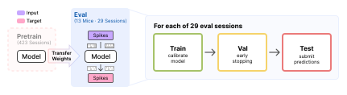
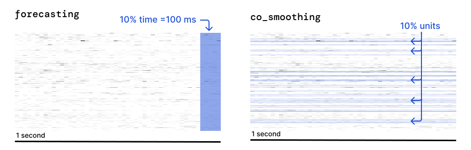
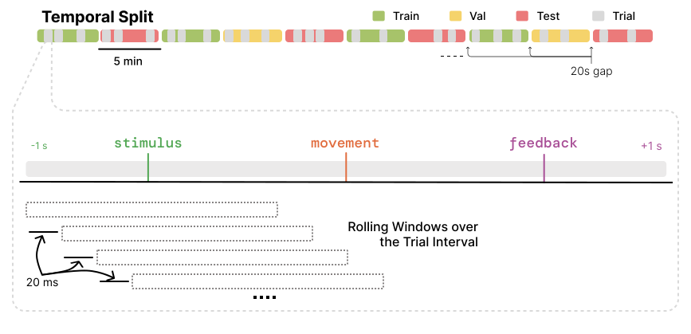

.. _ts2_guide:

Task Suite 2: Neural Activity Prediction
=========================================

TS2 evaluates neural activity prediction across time and neurons.

.. contents:: On this page
   :local:
   :depth: 2

Overview of TS2
----------------

Two tasks are included. **Forecasting** masks the last 10% of each context
window and requires the model to predict future activity from past
observations. **Co-smoothing** hides a fixed 10% of neurons per
session and requires the model to reconstruct their activity from the
remaining population. Both are scored with Poisson :math:`D^2` as the primary metric,
as well as bits-per-spike (bps).

   TS2 suite: co-smoothing (left) and forecasting (right) neural activity prediction targets.

Evaluation pipeline
~~~~~~~~~~~~~~~~~~~

Splits are time-based, interleaving 5-minute blocks. Train sees every unit and the whole context window;
val and test apply identical held-out procedures, so val metrics provide faithful proxies for test metrics.

.. note::

   Held-out units (co-smoothing) or timestamps (forecasting) are fixed per
   session and stripped from the input before ``input_fn`` runs. Val draws
   from its own independent hold-out set, so tuning against val cannot
   overfit test. Set ``val.mask_input=false`` only if your model cannot take
   a corrupted input (e.g. a plain autoencoder).

Test windows are emitted at a stride of one bin, not one window, so a submission
covers every bin-aligned window of the test split. The stride is fixed by the
standardized test path.

How to use the TS2 benchmark
-----------------------------

The TS2 evaluation pipeline is standardized and can be used with any model. There are two
ways to plug in:

1. **Use the standard pipeline**: implement :class:`~core.model.BaseModel` and pass your
   model to :class:`~ts2.TS2EvalTrainer` (extending it if needed). Training, checkpointing,
   and testing are all handled for you.
2. **Bring your own Trainer**: write your own training loop, but inherit from
   :class:`~ts2.TS2TestMixin` so testing stays standardized. This is required either way.

Key classes
~~~~~~~~~~~

- :class:`~ts2.IBLBrainWideBenchTS2`: dataset for a single session and task.
- :class:`~core.model.BaseModel`: model interface used by the standard pipeline.
- :class:`~ts2.TS2TestMixin`: mixin implementing standardized testing. Required for any Trainer.
- :class:`~ts2.TS2EvalTrainer`: standard Trainer, extends ``TS2TestMixin``.

Get a list of supported tasks
~~~~~~~~~~~~~~~~~~~~~~~~~~~~~

Use ``get_args`` on ``ibl_bwb_eval.tasks.TS2Task`` to see all available task names.

.. code-block:: python

   from typing import get_args

   from ibl_bwb_eval.tasks import TS2Task

   tasks = get_args(TS2Task)
   # ('co_smoothing', 'forecasting')

Loading splits for a specific task
~~~~~~~~~~~~~~~~~~~~~~~~~~~~~~~~~~

Construct :class:`~ts2.IBLBrainWideBenchTS2` directly to get the train/val/test split for one task and session.

.. code-block:: python

   from ts2 import IBLBrainWideBenchTS2

   train_dataset = IBLBrainWideBenchTS2(
       root="/path/to/data",
       split="train",
       task="co_smoothing",
       recording_id="<session_id>",
   )

How do I evaluate my pretrained model on TS2?
~~~~~~~~~~~~~~~~~~~~~~~~~~~~~~~~~~~~~~~~~~~~~

Given a pretrained model, evaluating on TS2 includes any necessary adaptations, followed by
standardized testing. Below we detail the steps for different use cases.

Model-level interface
^^^^^^^^^^^^^^^^^^^^^

If you pretrained in this repo, the model is already a :class:`~core.model.BaseModel`
subclass under ``src/pretrain/models/<model>/`` (:ref:`pretraining_guide`). TS2
finetunes that same class, where it is, so adapting it means adding the methods
pretraining never called.

A model pretrained outside the repo should implement the same interface, from wherever
it lives, to work with the Trainer infrastructure below. You are free to write your own
model and training interfaces instead, as long as testing stays standardized
(`Standardized testing`_).

Either way, make sure the model exposes the interface below:

.. code-block:: python

   from core.model import BaseModel

   class MyModel(BaseModel):
       def input_fn(self, data): ...                       # data -> model inputs (binned spikes)
       def link_datasets(self, train, val, test=None): ...  # optional, e.g. build a vocab
       def load_ckpt(self, ckpt): ...                        # optional, load pretrained weights
       def forward(self, spikes): ...                        # log-rates, shape (B, T, N)

.. note::

   Unlike TS1, TS2 has no per-task readout head to configure: the model always predicts
   log-rates for every neuron, and held-out positions are masked out of the loss/metrics
   rather than swapped for a different output. What the model has to handle is the axis
   the task predicts along: held-out units for co-smoothing, held-out timesteps for
   forecasting.

Using the standard TS2 Trainer
^^^^^^^^^^^^^^^^^^^^^^^^^^^^^^

We provide a standard Trainer for TS2, :class:`~ts2.TS2EvalTrainer`. Point a Hydra
config's ``model`` at your model and ``trainer`` at it:

.. code-block:: yaml

   model:
     _target_: my_package.MyModel
     # _target_: pretrain.models.my_model.MyModel  # a model pretrained in this repo
   trainer:
     _target_: ts2.TS2EvalTrainer

This can be used out-of-the-box if your model does not require any special adaptations.
It handles data loading, training, checkpointing, and standardized testing automatically.
Which parameters train is set by ``finetuning.strategy``: see :ref:`ts2_key_config`.

Customizing the TS2 Trainer
^^^^^^^^^^^^^^^^^^^^^^^^^^^

If you need to customize the Trainer, you can inherit from :class:`~ts2.TS2EvalTrainer` and
override individual methods (e.g. ``setup_model``, ``link_model``, ``training_step``) without
reimplementing the rest. Masking during training is the most common override:

.. code-block:: python

   from ts2 import TS2EvalTrainer

   class MyEvalTrainer(TS2EvalTrainer):
       def training_step(self, X, y):
           X["model_inputs"]["spikes"], mask = self.masker(X["model_inputs"]["spikes"])
           loss = self.loss_fn(self.predict(X), y["values"])
           return loss[mask].mean() if mask.sum() != 0 else loss.sum() * 0.0

Augmenting the training input
^^^^^^^^^^^^^^^^^^^^^^^^^^^^^

:class:`~ts2.TS2EvalTrainer` composes the transforms named in ``train_transforms`` onto the
dataset, ahead of the model's ``input_fn``. The list is empty in ``src/ts2/configs/train.yaml``;
set it in your trainer config to augment the sample before the model sees it:

.. code-block:: yaml

   train_transforms:
     - _target_: core.transforms.UnitDropout
       min_units: 0.6

``val_transforms`` and ``test_transforms`` work the same way and are normally left empty.
Augmentation listed here cannot corrupt the target, which is taken from the sample before
these run: see :ref:`pretraining_sample_flow`. Note that the masked modeling models corrupt
the input in ``training_step`` instead, through their masker: hiding positions and
predicting them is their training objective.

Standardized testing
^^^^^^^^^^^^^^^^^^^^

The standardized testing interface is implemented in the :class:`~ts2.TS2TestMixin` class.
This class handles loading the dataset, applying the benchmark hold-out mask, and computing
Poisson :math:`D^2` and bps. Note that :class:`~ts2.TS2EvalTrainer` inherits from it already.

Inherit from it before :class:`~core.trainer.BaseTrainer` in any custom Trainer to get
``setup_test_loader`` and ``test``. Validation is deliberately left out of the mixin, so
``setup_val_loader`` and ``val_epoch`` stay yours to define or override:

.. code-block:: python

   from core.trainer import BaseTrainer
   from ts2 import TS2TestMixin

   class MyEvalTrainer(TS2TestMixin, BaseTrainer):
       def predict(self, X, mask=None, mask_timestamps=None, mask_units=None):
           return self.model(**X["model_inputs"])

.. warning::

   Every Trainer has to test through :class:`~ts2.TS2TestMixin`, whether it is
   :class:`~ts2.TS2EvalTrainer` or one of your own. It fixes what a reported number
   means: the test split, the hold-out mask, the metrics and the prediction file.
   ``setup_test_loader`` and ``test`` are ``final`` for that reason, and the mixin
   itself is not yours to edit. A number from a test loop of your own is not comparable
   with the baselines.

Launching training and evaluation
----------------------------------

The entry point is ``src/ts2/train.py``, driven by `Hydra <https://hydra.cc>`_. One call trains
the model then automatically runs the standardized test protocol at the end:

.. code-block:: bash

   python src/ts2/train.py trainer=ndt recording_id=<recording_id> task=<task> \
       save_preds.enable=true save_preds.label=<submission-id>

``save_preds`` writes the prediction file the `leaderboard <https://brainwidebench.iblcore.org/index.html>`_ scores, one per
run at ``<label>/ts2-<task>/<recording_id>/seed_<seed>.safetensors`` under
``BWB_PREDICTIONS_DIR`` from your :ref:`.env <setup_env_file>` (default
``predictions/``), so a submission is one run per task and session. Drop both flags
to train without writing predictions.

The above command defines general-purpose execution on TS2, including for single-session baselines.
To finetune a pretrained model, select its trainer and point ``ckpt.load_from`` at a checkpoint:

.. code-block:: bash

   python src/ts2/train.py trainer=mtm_finetune recording_id=<recording_id> task=<task> \
       ckpt.load_from=/path/to/ckpt.pt \
       save_preds.enable=true save_preds.label=<submission-id>

.. _ts2_key_config:

Key config options
~~~~~~~~~~~~~~~~~~

Defaults live in ``src/ts2/configs/train.yaml``, and a trainer config overrides what it
needs. Two are worth setting deliberately: which parameters train, and when the run stops.

**Which parameters train.** ``finetuning.strategy`` is null by default, so all of them do.
Three strategies ship:

.. code-block:: yaml

   finetuning:
     enable: true
     strategy:
       _target_: core.finetuning.GradualUnfreezing
       unfrozen_prefixes: [unit_emb., session_emb.]
       unfreeze_at_epoch: 40

- :class:`~core.finetuning.Probe` freezes every parameter whose name starts with none of
  ``unfrozen_prefixes``.
- :class:`~core.finetuning.GradualUnfreezing` does the same, then releases the rest at
  ``unfreeze_at_epoch``.
- :class:`~core.finetuning.FullFinetuning` trains everything and takes no arguments, and is
  what both shipped finetunes use.

**Early stopping.** Validation drives it:

.. code-block:: yaml

   val:
     every_n_epochs: 10    # how often validation runs
     patience: 20          # stop after this many validations without improvement
     start_patience: 100   # do not start counting down before this epoch
     minimize: false       # false keeps the highest score, true the lowest

Improvement is measured on Poisson :math:`D^2`, the primary metric for both tasks.

.. warning::

   ``base_lr`` reaches the optimizer as written, with none of the ``sqrt(batch_size)``
   scaling most :ref:`pretraining <pretraining_guide>` trainers apply, so a ``base_lr``
   carried over from a pretraining config is not the same learning rate here.

Reference baselines
--------------------

The training runs behind these baselines are accessible on `W&B
<https://wandb.ai/ibl-benchmark/projects>`_, linked from each row below.

Pretrained
~~~~~~~~~~

Adapted from a checkpoint pretrained in ``src/pretrain``, so each requires
``ckpt.load_from`` (:ref:`pretrain_released_ckpts`).

.. list-table::
   :widths: 15 28 49 8
   :header-rows: 1

   * - Model
     - Trainer config
     - Trainer class
     - W&B
   * - `NDT Stitch <https://www.biorxiv.org/content/early/2021/07/23/2021.01.16.426955>`__
     - ``ndt_stitch_finetune``
     - :class:`~ts2.models.pretrained.NDTStitchEvalTrainer`
     - .. image:: https://raw.githubusercontent.com/wandb/assets/main/wandb-dots-logo.svg
          :class: dark-light
          :target: https://wandb.ai/ibl-benchmark/ts2-ndt_stitch-ft-release
          :alt: W&B project ts2-ndt_stitch-ft-release
          :width: 22px
   * - `MtM <https://openreview.net/forum?id=nRRJsDahEg>`__
     - ``mtm_finetune``
     - :class:`~ts2.models.pretrained.MtMEvalTrainer`
     - .. image:: https://raw.githubusercontent.com/wandb/assets/main/wandb-dots-logo.svg
          :class: dark-light
          :target: https://wandb.ai/ibl-benchmark/ts2-mtm-ft-release
          :alt: W&B project ts2-mtm-ft-release
          :width: 22px

Pass a row's Trainer config to reproduce that baseline, the same command each released
result came from:

.. code-block:: bash

   python src/ts2/train.py trainer=<trainer config> recording_id=<recording_id> \
       task=<task> ckpt.load_from=/path/to/ckpt.pt

Single session
~~~~~~~~~~~~~~

Fit on one session from scratch, no checkpoint needed.

.. list-table::
   :widths: 30 18 44 8
   :header-rows: 1

   * - Model
     - Trainer config
     - Trainer class
     - W&B
   * - Autoencoder MLP
     - ``autoencoder``
     - :class:`~ts2.TS2EvalTrainer`
     - .. image:: https://raw.githubusercontent.com/wandb/assets/main/wandb-dots-logo.svg
          :class: dark-light
          :target: https://wandb.ai/ibl-benchmark/ts2-ae-ss-release-seeds
          :alt: W&B project ts2-ae-ss-release-seeds
          :width: 22px
   * - `NDT <https://www.biorxiv.org/content/early/2021/07/23/2021.01.16.426955>`__
     - ``ndt``
     - :class:`~ts2.models.single_session.NDTEvalTrainer`
     - .. image:: https://raw.githubusercontent.com/wandb/assets/main/wandb-dots-logo.svg
          :class: dark-light
          :target: https://wandb.ai/ibl-benchmark/ts2-ndt-ss-release-seeds
          :alt: W&B project ts2-ndt-ss-release-seeds
          :width: 22px
   * - `LFADS <https://doi.org/10.1038/s41592-018-0109-9>`__
     - ``lfads``
     - :class:`~ts2.models.single_session.LFADSEvalTrainer`
     - .. image:: https://raw.githubusercontent.com/wandb/assets/main/wandb-dots-logo.svg
          :class: dark-light
          :target: https://wandb.ai/ibl-benchmark/ts2-lfads-ss-release-seeds
          :alt: W&B project ts2-lfads-ss-release-seeds
          :width: 22px
   * - Population coupling
     - ``pop_coupling``
     - :class:`~ts2.models.single_session.StatBaselineTrainer`
     - .. image:: https://raw.githubusercontent.com/wandb/assets/main/wandb-dots-logo.svg
          :class: dark-light
          :target: https://wandb.ai/ibl-benchmark/ts2-stat-pop_coupling-release
          :alt: W&B project ts2-stat-pop_coupling-release
          :width: 22px
   * - Ridge AR
     - ``ridge_ar``
     - :class:`~ts2.models.single_session.StatBaselineTrainer`
     - .. image:: https://raw.githubusercontent.com/wandb/assets/main/wandb-dots-logo.svg
          :class: dark-light
          :target: https://wandb.ai/ibl-benchmark/ts2-stat-ridge_ar-release
          :alt: W&B project ts2-stat-ridge_ar-release
          :width: 22px
   * - Reduced-rank readout
     - ``readout_rrr``
     - :class:`~ts2.models.single_session.StatBaselineTrainer`
     - .. image:: https://raw.githubusercontent.com/wandb/assets/main/wandb-dots-logo.svg
          :class: dark-light
          :target: https://wandb.ai/ibl-benchmark/ts2-stat-readout_rrr-release
          :alt: W&B project ts2-stat-readout_rrr-release
          :width: 22px
   * - Reduced-rank readout + ISI
     - ``readout_isi``
     - :class:`~ts2.models.single_session.StatBaselineTrainer`
     - .. image:: https://raw.githubusercontent.com/wandb/assets/main/wandb-dots-logo.svg
          :class: dark-light
          :target: https://wandb.ai/ibl-benchmark/ts2-stat-readout_isi-release
          :alt: W&B project ts2-stat-readout_isi-release
          :width: 22px
   * - Shrinkage
     - ``shrinkage``
     - :class:`~ts2.models.single_session.StatBaselineTrainer`
     - .. image:: https://raw.githubusercontent.com/wandb/assets/main/wandb-dots-logo.svg
          :class: dark-light
          :target: https://wandb.ai/ibl-benchmark/ts2-stat-shrinkage-release
          :alt: W&B project ts2-stat-shrinkage-release
          :width: 22px
   * - Trailing mean
     - ``trailing_mean``
     - :class:`~ts2.models.single_session.StatBaselineTrainer`
     - .. image:: https://raw.githubusercontent.com/wandb/assets/main/wandb-dots-logo.svg
          :class: dark-light
          :target: https://wandb.ai/ibl-benchmark/ts2-stat-trailing_mean-release
          :alt: W&B project ts2-stat-trailing_mean-release
          :width: 22px

Same command to reproduce one of these, with no checkpoint to load:

.. code-block:: bash

   python src/ts2/train.py trainer=<trainer config> recording_id=<recording_id> task=<task>
