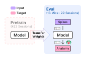

.. _ts3_guide:

Task Suite 3: Brain Region Prediction
=======================================

TS3 evaluates neuron-level representations by predicting the Cosmos-level
anatomical region (10 classes, Allen CCF) of individual units. Regions span
coarse but functionally meaningful areas such as Isocortex, Hippocampus, and
Cerebellum. Both single-unit and multi-unit settings are covered.

All evaluations are zero-shot on held-out animals. Two regimes are included:
**transductive zero-shot** (adaptation via non-region supervision is allowed)
and **inductive zero-shot** (no adaptation). Performance is reported as
macro-averaged F1 to account for class imbalance.

Key classes
-----------

- :class:`~pretrain.models.NuCLR` / :class:`~pretrain.models.NuCLRPretrain`:   contrastive pretraining on single-unit features.
- :class:`~pretrain.models.NEMO` / :class:`~pretrain.models.NEMOPretrain`:   multimodal WVF+ACG alignment via CLIP loss (``core.nn.loss.CLIPLoss``).
- :class:`~pretrain.models.WVFEncoder`, :class:`~pretrain.models.ACGEncoder`,
  :class:`~pretrain.models.LinearProjector`: building blocks for NEMO-style
  encoders.
- :class:`~ts3.models.supervised.LOLCAT` / :class:`~ts3.models.supervised.LOLCATTrainer`: supervised classifier over a
  unit's per-trial ISI histograms, pooled by :class:`~ts3.models.supervised.MultiHeadGlobalAttention`
  and class-rebalanced by :class:`~ts3.models.supervised.LossFeedbackSampler`.
- :func:`~ts3.compute_isi_histogram`: the feature behind the training-free ISI
  baseline.

Model families
--------------

NuCLR and NEMO pretrain from ``src/pretrain/train.py``, alongside the TS1 and
TS2 pretraining models; LOLCAT and the ISI baseline stay in ``src/ts3``. Turning any
of them into unit embeddings is one step, ``src/ts3/extract.py``, and which extractor
it runs is grouped by regime under ``src/ts3/models/``: ``inductive/`` for the models
whose unit embedding is a function of the unit's own data, ``transductive/`` for those
whose unit embedding is a free parameter that exists only for units a run has seen.

**NuCLR** learns a shared embedding space from unit features using contrastive
learning. Pretraining is handled by :class:`~pretrain.models.NuCLRPretrain`; the
loss is :class:`~pretrain.models.NuCLRLoss`.

**NEMO** fuses waveform and autocorrelogram modalities via a CLIP-style objective.
:class:`~pretrain.models.WVFEncoder` and :class:`~pretrain.models.ACGEncoder`
produce per-modality embeddings that are aligned by ``core.nn.loss.CLIPLoss``
through a :class:`~pretrain.models.LinearProjector`.

**LOLCAT** is supervised rather than pretrained. An MLP embeds each of a unit's
per-trial ISI histograms, :class:`~ts3.models.supervised.MultiHeadGlobalAttention` pools the trials
into one unit-level vector, and a linear head predicts the region, so it reports
F1 directly instead of going through a probe.
:class:`~ts3.models.supervised.LossFeedbackSampler` retunes the per-class oversampling factors
between epochs from the train/val loss gap.

**ISI histograms** is a training-free baseline. ``extractor=isi`` writes one
log-spaced, L1-normalised :func:`~ts3.compute_isi_histogram` per unit and uses it
directly as the embedding.

After pretraining, a probe is fit on top of frozen embeddings by
``ts3/eval.py`` with ``probe=linear`` or ``probe=mlp``, and scored with macro-averaged
F1. LOLCAT skips this step. NuCLR and Nemo also probe themselves while pretraining, but
that monitor belongs to each of them (``pretrain/models/*/monitor.py``) and reads
pretrain units only, so it never touches the units scored here.

.. _ts3_released_embeddings:

The released NuCLR and NEMO repositories ship the unit embeddings each of their
checkpoints produced, as ``<model>_embeddings_<seed>.pt``, so
``ts3/eval.py emb_path=<FILE>`` probes them directly and ``extract.py`` need not run
again. :ref:`pretrain_released_ckpts` covers the download.

Launching training and evaluation
---------------------------------

TS3 scores a probe on frozen unit embeddings, so most baselines are two calls, both driven
by `Hydra <https://hydra.cc>`_: write the embeddings with ``src/ts3/extract.py``, then fit
and score the probe with ``src/ts3/eval.py``.

An inductive extractor reads one pretrain checkpoint (:ref:`pretrain_released_ckpts`) and
encodes the pretrain and eval units with it:

.. code-block:: bash

   python src/ts3/extract.py extractor=nuclr data_root=<data_root> extractor.ckpt=/path/to/ckpt.pt

``extractor=isi`` is training free and takes no checkpoint at all. A transductive extractor
also needs the per-session finetuning checkpoints, which it finds by scanning
``extractor.ckpt_dir`` for the one ``best.pt`` per eval recording written at that seed:

.. code-block:: bash

   python src/ts3/extract.py extractor=poyo data_root=<data_root> \
       extractor.pretrain_ckpt=/path/to/ckpt.pt extractor.seed=<seed>

Either way the embeddings land in ``embs_dir`` (``BWB_EMBS_DIR``, default ``embs/``). Pass
that file to the probe, which reports macro F1 single-unit and multi-unit:

.. code-block:: bash

   python src/ts3/eval.py probe=linear data_root=<data_root> emb_path=/path/to/embeddings.pt

The linear probe is CPU only and takes about 30 seconds; ``probe=mlp`` searches
``probe.num_trials`` configurations on a GPU instead, about 20 minutes per file on an
RTX 5090. The
released NuCLR and NEMO embeddings (:ref:`above <ts3_released_embeddings>`) go straight
into ``emb_path``, so reproducing those two baselines needs only this second call.

LOLCAT is supervised on the region labels and has no embedding step, so it trains and runs
the test protocol in one call, like a TS1 or TS2 baseline:

.. code-block:: bash

   python src/ts3/train.py trainer=lolcat data_root=<data_root>

Reference baselines
-------------------

Select any of these with the override in the Config column, on the entry point its
regime uses above.

Training runs for these baselines are public at `wandb.ai/ibl-benchmark
<https://wandb.ai/ibl-benchmark/projects>`_. TS3 scores a probe rather than the encoder, so
its projects are named ``ts3-<model>-probe-release`` and hold the probe runs behind
the reported numbers, not the pretraining they read from. LOLCAT is scored without a
probe, so its project drops that part of the name.

.. list-table::
   :widths: 16 30 46 8
   :header-rows: 1

   * - Model
     - Config
     - Regime
     - W&B
   * - ISI histograms
     - ``extractor=isi``
     - Inductive, training-free
     - .. image:: https://raw.githubusercontent.com/wandb/assets/main/wandb-dots-logo.svg
          :class: dark-light
          :target: https://wandb.ai/ibl-benchmark/ts3-isi-probe-release
          :alt: W&B project ts3-isi-probe-release
          :width: 22px
   * - `NEMO <https://openreview.net/forum?id=10JOlFIPjt>`__
     - ``extractor=nemo``
     - Inductive
     - .. image:: https://raw.githubusercontent.com/wandb/assets/main/wandb-dots-logo.svg
          :class: dark-light
          :target: https://wandb.ai/ibl-benchmark/ts3-nemo-probe-release
          :alt: W&B project ts3-nemo-probe-release
          :width: 22px
   * - `NuCLR <https://openreview.net/forum?id=zt3RKc6VBp>`__
     - ``extractor=nuclr``
     - Inductive
     - .. image:: https://raw.githubusercontent.com/wandb/assets/main/wandb-dots-logo.svg
          :class: dark-light
          :target: https://wandb.ai/ibl-benchmark/ts3-nuclr-probe-release
          :alt: W&B project ts3-nuclr-probe-release
          :width: 22px
   * - `NDT Stitch <https://www.biorxiv.org/content/early/2021/07/23/2021.01.16.426955>`__
     - ``extractor=ndt_stitch``
     - Transductive
     -
   * - `POYO <https://openreview.net/forum?id=IuU0wcO0mo>`__
     - ``extractor=poyo``
     - Transductive
     -
   * - `LOLCAT <https://doi.org/10.1016/j.celrep.2023.112318>`__
     - ``trainer=lolcat``
     - Supervised, no probe
     - .. image:: https://raw.githubusercontent.com/wandb/assets/main/wandb-dots-logo.svg
          :class: dark-light
          :target: https://wandb.ai/ibl-benchmark/ts3-lolcat-release
          :alt: W&B project ts3-lolcat-release
          :width: 22px

.. _ts3_unit_qc:

Two layers of unit QC
---------------------

Unit QC is applied at two independent points, and the two do not enforce the same
rule. Knowing which layer you are reading explains most apparent inconsistencies.

**Build time** bakes the three filters from :ref:`dataset_builds` into the
``.h5``. It defines the stored population, and it is what ``unit_filtering`` records.

**Load time** is applied by the consuming task suite on top of whatever the build
contains. It is task specific and is never recorded in the file.

Mostly, load time just re-verifies the build. These three criteria are checked at
both layers with identical thresholds, so they never change the population:

.. list-table::
   :widths: 34 33 33
   :header-rows: 1

   * - Criterion
     - Build time
     - Re-applied by TS3 scoring
   * - ``qc_neural`` (probe QC)
     - ``== PASS``, eval only
     - ``== PASS`` on eval
   * - ``firing_rate``
     - ``> 1.0`` Hz
     - ``> 1.0`` Hz
   * - ``unit_qc`` label
     - ``== 1.0``
     - ``== 1.0``

Only three criteria are genuinely load time. No build applies them, so no
``--unit-filter`` value can satisfy them:

.. list-table::
   :widths: 28 30 42
   :header-rows: 1

   * - Criterion
     - Rule
     - Applied by
   * - ``qc_neural`` on pretrain
     - ``!= FAIL``, so ``WARNING`` is kept
     - the TS3 dataset mask and scoring, identically
   * - ``qc_neural_alignment``
     - ``== PASS``
     - TS3 scoring
   * - Brain region
     - not ``void`` or ``root``
     - TS3 scoring

Two consequences are worth stating plainly:

* Because ``probe_qc`` is not applied to pretrain sessions, a pretrain build
  labeled ``selected_units`` still contains units on probes whose ``qc_neural``
  is ``WARNING`` or ``FAIL``. TS3 masks the ``FAIL`` ones at load time and trains
  on the ``WARNING`` ones, which are about 30% of pretrain probes. TS3 also drops
  the 32 pretrain sessions whose every probe is ``FAIL``.
* Because the last two criteria are invisible to the build, ``selected_units`` does
  not mean "the population TS3 scores on"; that population is pinned by
  ``_EXPECTED_MD_SIZE`` in ``src/ts3/protocol.py``.
